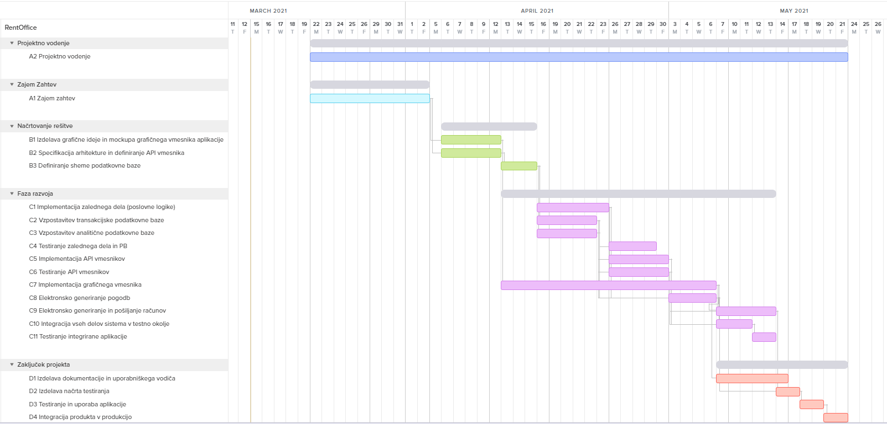

# Predlog projekta

| | |
|:---|:---|
| **Naziv projekta** | RentOffice |
| **Člani projektne skupine** | Simon Babnik, Gašper Groznik, Gjorgji Jovanov, Sanil Safić, Anja Vihar |
| **Kraj in datum** | Ljubljana, 15.3.2021 |

## Povzetek projekta

Dandanes ima praktično skoraj vsako podjetje svoje poslovne prostore, ki jih uporablja za sestanke in pisarniško delo. S prihodom novega koronavirusa pa se je situacija nekoliko spremenila. Sedaj se je namreč uveljavila praksa, da lahko veliko ljudi opravlja dela od doma namesto na fizični lokaciji, če je to le možno. Posledično so postali pisarniški prostori prazni, neizkoriščeni in predstavljajo zgolj strošek, saj jih je še vseeno potrebno vzdrževati. Naš cilj je, da ta problem rešimo z našo programsko rešitvijo, s pomočjo katere bodo lahko podjetja najemala poslovne prostore zgolj takrat, ko jih bodo dejansko uporabljala. Spletna aplikacija bo namenjena podjetjem (najemnikom), ki bodo najemala poslovne prostore, in ponudnikom poslovnih prostorov (najemodajalcem). Preko spletne aplikacije bo podjetjem omogočena izbira velikosti pisarne, izbira pisarniške opreme, izbira dodatnih prostorov, sklenitev najemniške pogodbe ter izvedba plačila najemnine. Najemodajalcem bo omogočeno vnašanje ponudbe, v kateri so zajete zgoraj navedene stvari, prav tako pa bodo lahko tudi potrdili najemniško pogodbo s podjetjem. Administratorjem sistema bo dovoljen dostop do zgodovine vseh izvedenih transakcij in dogodkov v namen analitičnih obdelav oziroma pomoči uporabnikom.

Do sedaj na trgu še ni podobne programske rešitve, to pa se nam glede na trenutno situacijo zdi vredno izkoristiti, saj si veliko podjetij želi na tak način zmanjšati nepotrebne stroške, povezane s praznimi pisarniškimi prostori.

## 1. Projektna ideja

### 1.1 Ozadje

V večini primerov imajo podjetja pisarniške prostore zakupljene ali v najemu. Covid-19 kriza je privedla do dela od doma, kjer je to le mogoče (torej predvsem pisarniška dela) in veliko podjetij bo tak način dela nadaljevalo v večjem obsegu tudi po končani krizi. Kmalu bodo podjetja ugotovila, da ni smiselno imeti zakupljene tako velike pisarne, če bodo le-te večino časa prazne. Tukaj pride v igro naša rešitev, saj bodo z njeno pomočjo podjetja lahko plačevala najem pisarniških prostorov zgolj toliko, kolikor jih bodo dejansko uporabljala. Do sedaj na trgu obstajajo zgolj portali, kjer ljudje oglašujejo prodajo svojih nepremičnin drugim fizičnim osebam (npr. nepremicnine.net), ne obstaja pa storitev, ki ponuja najemanje pisarniških prostorov pravnim osebam.

### 1.2 Področje in motivacija

Za projekt smo se odločili, ker verjamemo da bo glede na trenutno stanje trga uspešen in obenem tudi izvedljiv. Strankam lahko ponudimo nekaj, česar ni še nihče pred nami naredil in tukaj imamo vsekakor prednost. Naša tehnološka rešitev bi kot prva omogočala sklenitev pogodbe in pravno podlago med najemodajalci in pravnimi osebami, pri čimer pa bi zelo olajšala celoten postopek sklenitve najemniške pogodbe in plačevanja. Prav tako bi bili prvi na trgu, ki bi omogočali najem pisarne za krajši časovni rok (npr. samo za 1 mesec ali še manj) in ne samo na dolgi rok (npr. najmanj 1 leto). Z razvojem programske rešitve bomo uporabnikom omogočili storitev »vse na enem mestu«, saj bodo lahko vse potrebne stvari za najem pisarne opravili preko nas, brez potrebnega osebnega obiska na fizični lokaciji, kar strankam vsekakor olajša delo. Z našim projektom ciljamo predvsem mikro, mala in srednja podjetja, ki so se odločila za povečan obseg dela od doma in si želijo zmanjšati strošek z najemom svojih pisarniških prostorov. Prav tako je naša rešitev namenjena tudi ostalim potencialnim najemodajalcem, ki bi svoje objekte preko naše platforme ponujali v najem. Ciljne uporabnike bomo prepričali z oglaševanjem, kjer jim bomo prikazali, koliko denarja lahko prihranijo z uporabo naših rešitev.

### 1.3 Namen

* Zmanjšanje stroškov najema pisarniških prostorov podjetij,
* omogočiti celoten proces sklenitve pogodbe preko spleta,
* zagotoviti pravno podlago najemnikom in najemodajalcem,
* enostavnejše iskanje novega najemodajalca,

### 1.4 Cilji

* Nameščen in testiran informacijski sistem,
* uporabniška dokumentacija,
* tehnična dokumentacija podatkovne baze (logični in fizični model),
* tehnična dokumentacija spletne aplikacije,
* video vodiči za pomoč novim uporabnikom

### 1.5 Smernice za rešitev

* Sistem mora delovati izključno digitalno,
* lahka prepoznavnost,
* interaktiven in odziven spletni uporabniški vmesnik,
* sistem mora podpirati HTML5,
* prednost odprtokodnim rešitvam

### 1.6 Končni uporabniki  

* Končni uporabniki bodo osebe, ki so v podjetjih zadolžene za ravnanje s pisarniškimi prostori (njihov nakup, plačevanje stroškov, iskanje novih, ...) in najemodajalci. 
* Naše stranke bodo predvsem mikro, mala in srednja podjetja (1 - 250 zaposlenih) ter seveda najemodajalci, ki jim bodo ponujali poslovne prostore.

## 2. Projektni načrt

Projekt sestoji iz 4 delov. Vsak del je logično ločen in pomemben, da lahko dosežemo željen cilj. 

### 2.1 Povzetek razdelitve projekta na aktivnosti

### Zajem zahtev
Osnovno projektno vodenje z zajemom zahtev in opredelitvijo tveganj. Osredotočimo se na vse zahteve, potencialna tveganja in njihove rešitve, ter vloge vsakega člana od začetka do konca izvedbe projekta.

### Načrtovanje rešitve
Specificiranje arhitekture in uporabe tehnologij. Izdelava osnovne grafične podobe in vmesnika, da si člani ekipe kot tudi stranke lažje predstavljajo načrtovano rešitev. Izdelava sheme transakcijske in analitične podatkovne baze in projektno vodenje.

### Faza razvoja
Dejanska implementacija vseh potrebnih elementov aplikacije. Izdelava vmesnika in poslovne logike, ustrezno mapiranje podatkovnega skladišča, testiranje, grafični vmesnik, komunikacija med zalednim, čelnim in podatkovnim delom, ter integracija vseh delov sistema v testno okolje in projektno vodenje.

### Zaključek projekta
Projektno vodenje, celotna dokumentacija, testiranje vseh delov sistema in pripravljanje aplikacije za integracijo v produkcijsko okolje.

### 2.2 Načrt posameznih aktivnosti

Urnik je Pon-Pet, 60h na mesec, 15h na teden, 3 na dan --> 0.05 ČM

| **Oznaka aktivnosti**                               | A1                                                           |
| :-------------------------------------------------- | :----------------------------------------------------------- |
| **Predvideni datum pričetka izvajanja aktivnosti**  | 22.3.2021                                                    |
| **Predvideni datum zaključka izvajanja aktivnosti** | 2.4.2021                                                     |
| **Trajanje**                                        | 10                                                           |
| **Naziv aktivnosti**                                | Zajem zahtev                                                 |
| **Obseg aktivnosti v ČM**                           | 0,5 (10 dni * 3 ure na dan = 30 ur dela => 30 ur / 60 ur na mesec = 0,5) |
| **Seznam ciljev aktivnosti (kaj želite doseči)**    | Opredeljena specifikacija končnega produkta                  |
| **Opis aktivnosti**                                 | Opredelitev vseh potrebnih zahtev in izdelava osnovne specifikacije produkta |
| **Morebitne odvisnosti in omejitve**                | Ni odvisnosti. Je na kritični poti                           |
| **Pričakovani rezultati aktivnosti**                | Formalno in jedrnato izdelana specifikacija končnega produkta |

| **Oznaka aktivnosti**                               | A2                                                           |
| :-------------------------------------------------- | :----------------------------------------------------------- |
| **Predvideni datum pričetka izvajanja aktivnosti**  | 22.3.2021                                                    |
| **Predvideni datum zaključka izvajanja aktivnosti** | 21.5.2021                                                    |
| **Trajanje**                                        | 43                                                           |
| **Naziv aktivnosti**                                | Projektno vodenje                                            |
| **Obseg aktivnosti v ČM**                           | 2,15 (43 dni * 3 ure na dan = 135 ur dela => 135 ur / 60 ur na mesec = 2,15) |
| **Seznam ciljev aktivnosti (kaj želite doseči)**    | Uskladitev članov skupine, dodelitev dela in primernih aktivnosti |
| **Opis aktivnosti**                                 | Projektni vodja dodeli članom ekipe delo na projektu glede na njihove zmožnosti in sposobnosti, prav tako pa nadzoruje, kako so posamezni deli projekta med seboj usklajeni |
| **Morebitne odvisnosti in omejitve**                | A1. Ni na kritični                                           |
| **Pričakovani rezultati aktivnosti**                | Jasna navodila za člane projekta in dobra razdelitev dela    |

| **Oznaka aktivnosti**                               | B1                                                           |
| :-------------------------------------------------- | :----------------------------------------------------------- |
| **Predvideni datum pričetka izvajanja aktivnosti**  | 6.4.2021                                                     |
| **Predvideni datum zaključka izvajanja aktivnosti** | 12.4.2021                                                    |
| **Trajanje**                                        | 5                                                            |
| **Naziv aktivnosti**                                | Izdelava grafične ideje in mockupa grafičnega vmesnika aplikacije. |
| **Obseg aktivnosti v ČM**                           | 0,25 (5 dni * 3 ure na dan = 15 ur dela => 15 ur / 60 ur na mesec = 0,25) |
| **Seznam ciljev aktivnosti (kaj želite doseči)**    | Kreiranje grafične podobe produkta, izdelava mockupa grafičnega vmesnika aplikacije. |
| **Opis aktivnosti**                                 | Izdelava predvidenih pogledov aplikacije, katere se uporabi kot vodilo pri izdelavi in implementaciji funkcionalnosti. |
| **Morebitne odvisnosti in omejitve**                | A1. Ni na kritični                                           |
| **Pričakovani rezultati aktivnosti**                | Izdelani grafični pogledi aplikacije                         |

| **Oznaka aktivnosti**                               | B2                                                           |
| :-------------------------------------------------- | :----------------------------------------------------------- |
| **Predvideni datum pričetka izvajanja aktivnosti**  | 6.4.2021                                                     |
| **Predvideni datum zaključka izvajanja aktivnosti** | 12.4.2021                                                    |
| **Trajanje**                                        | 5                                                            |
| **Naziv aktivnosti**                                | Specifikacija arhitekture in definiranje API vmesnika        |
| **Obseg aktivnosti v ČM**                           | 0,25 (5 dni * 3 ure na dan = 15 ur dela => 15 ur / 60 ur na mesec = 0,25) |
| **Seznam ciljev aktivnosti (kaj želite doseči)**    | Kreiranje ustrezne specifikacije za enostavno implementacijo API |
| **Opis aktivnosti**                                 | Izdelava specifikacije API vmesnika, definiranje končnih dostopnih točk in objektov, ki bodo vsebovali API, izbira tehnologij za implementacijo. |
| **Morebitne odvisnosti in omejitve**                | A1. Je na kritični                                           |
| **Pričakovani rezultati aktivnosti**                | Natačna in ustrezna specifikacija zunanjega in REST API      |

| **Oznaka aktivnosti**                               | B3                                                           |
| :-------------------------------------------------- | :----------------------------------------------------------- |
| **Predvideni datum pričetka izvajanja aktivnosti**  | 13.4.2021                                                    |
| **Predvideni datum zaključka izvajanja aktivnosti** | 15.4.2021                                                    |
| **Trajanje**                                        | 3                                                            |
| **Naziv aktivnosti**                                | Definiranje sheme podatkovne baze                            |
| **Obseg aktivnosti v ČM**                           | 0,15 (3 dni * 3 ure na dan = 9 ur dela => 9 ur / 60 ur na mesec = 0,15) |
| **Seznam ciljev aktivnosti (kaj želite doseči)**    | Definiranje entitet in povezav v transakcijski in analitični podatkovni bazi |
| **Opis aktivnosti**                                 | Opredelitev sheme PB, izbira ustreznih tehnologij za implementacijo in definiranje podatkov za obe PB. |
| **Morebitne odvisnosti in omejitve**                | B2. Je na kritični                                           |
| **Pričakovani rezultati aktivnosti**                | Načrt podatkovnih baz                                        |

| **Oznaka aktivnosti**                               | C1                                                           |
| :-------------------------------------------------- | :----------------------------------------------------------- |
| **Predvideni datum pričetka izvajanja aktivnosti**  | 16.4.2021                                                    |
| **Predvideni datum zaključka izvajanja aktivnosti** | 23.4.2021                                                    |
| **Trajanje**                                        | 6                                                            |
| **Naziv aktivnosti**                                | Implementacija zalednega dela (poslovne logike)              |
| **Obseg aktivnosti v ČM**                           | 0,3 (6 dni * 3 ure na dan = 18 ur dela => 18 ur / 60 ur na mesec = 0,3) |
| **Seznam ciljev aktivnosti (kaj želite doseči)**    | Implementacija poslovne logike sistema, vzpostavljena komunikacija med PB in zalednim delom. |
| **Opis aktivnosti**                                 | S tehnologijami implementirana osnovna zgradba zalednega dela, pridobivanje in shranjevanje podatkov v PB. |
| **Morebitne odvisnosti in omejitve**                | B3. Je na kritični                                           |
| **Pričakovani rezultati aktivnosti**                | Delujoč zaledni del sistema                                  |

| **Oznaka aktivnosti**                               | C2                                                           |
| :-------------------------------------------------- | :----------------------------------------------------------- |
| **Predvideni datum pričetka izvajanja aktivnosti**  | 16.4.2021                                                    |
| **Predvideni datum zaključka izvajanja aktivnosti** | 22.4.2021                                                    |
| **Trajanje**                                        | 5                                                            |
| **Naziv aktivnosti**                                | Vzpostavitev transakcijske podatkovne baze                   |
| **Obseg aktivnosti v ČM**                           | 0,25 (5 dni * 3 ure na dan = 15 ur dela => 15 ur / 60 ur na mesec = 0,25) |
| **Seznam ciljev aktivnosti (kaj želite doseči)**    | Kreiranje transakcijske podatkovne baze z vnešenimi testnimi podatki |
| **Opis aktivnosti**                                 | Vzpostavitev transakcijske podatkovne baze in kreiranje testnih podatkov, ki so skladni s shemo PB. |
| **Morebitne odvisnosti in omejitve**                | B3. Ni na kritični                                           |
| **Pričakovani rezultati aktivnosti**                | Delujoča transakcijska podatkovna baza                       |

| **Oznaka aktivnosti**                               | C3                                                           |
| :-------------------------------------------------- | :----------------------------------------------------------- |
| **Predvideni datum pričetka izvajanja aktivnosti**  | 16.4.2021                                                    |
| **Predvideni datum zaključka izvajanja aktivnosti** | 22.4.2021                                                    |
| **Trajanje**                                        | 5                                                            |
| **Naziv aktivnosti**                                | Vzpostavitev analitične podatkovne baze                      |
| **Obseg aktivnosti v ČM**                           | 0,25 (5 dni * 3 ure na dan = 15 ur dela => 15 ur / 60 ur na mesec = 0,25) |
| **Seznam ciljev aktivnosti (kaj želite doseči)**    | Ustvarjena analitična podatkovna baza z vnešenimi testnimi podatki |
| **Opis aktivnosti**                                 | Vzpostavitev analitične podatkovne baze in vnos testnih podatkov, ki so skladni s shemo PB. |
| **Morebitne odvisnosti in omejitve**                | B3. Ni na kritični                                           |
| **Pričakovani rezultati aktivnosti**                | Delujoča analitična podatkovna baza                          |

| **Oznaka aktivnosti**                               | C4                                                           |
| :-------------------------------------------------- | :----------------------------------------------------------- |
| **Predvideni datum pričetka izvajanja aktivnosti**  | 26.4.2021                                                    |
| **Predvideni datum zaključka izvajanja aktivnosti** | 29.4.2021                                                    |
| **Trajanje**                                        | 3                                                            |
| **Naziv aktivnosti**                                | Testiranje zalednega dela in PB                              |
| **Obseg aktivnosti v ČM**                           | 0,15 (3 dan * 3 ure na dan = 9 ur dela => 9 ur / 60 ur na mesec = 0,15) |
| **Seznam ciljev aktivnosti (kaj želite doseči)**    | Testirana komunikacija med zalednim delom in PB.             |
| **Opis aktivnosti**                                 | S testiranjem preverimo, če navedeni implementirani deli do zdaj delujejo pravilno, v skladu s projektnim načrtom. |
| **Morebitne odvisnosti in omejitve**                | C1, C2, C3. Ni na kritični                                   |
| **Pričakovani rezultati aktivnosti**                | Delujoča transakcijska in analitična baza, pravilna komunikacija med zalednim delom in bazama. |

| **Oznaka aktivnosti**                               | C5                                                           |
| :-------------------------------------------------- | :----------------------------------------------------------- |
| **Predvideni datum pričetka izvajanja aktivnosti**  | 26.4.2021                                                    |
| **Predvideni datum zaključka izvajanja aktivnosti** | 30.4.2021                                                    |
| **Trajanje**                                        | 4                                                            |
| **Naziv aktivnosti**                                | Implementacija API vmesnikov                                 |
| **Obseg aktivnosti v ČM**                           | 0,2 (4 dni * 3 ure na dan = 12 ur dela => 12 ur / 60 ur na mesec = 0,2) |
| **Seznam ciljev aktivnosti (kaj želite doseči)**    | Implementirati ustrezne končne točke sistema.                |
| **Opis aktivnosti**                                 | Implementacija ustreznih API dostopnih točk in avtentikacija. |
| **Morebitne odvisnosti in omejitve**                | C1, C2, C3. Je na kritični                                   |
| **Pričakovani rezultati aktivnosti**                | Delujoč in varen API vmesnik (zunanji in REST)               |

| **Oznaka aktivnosti**                               | C6                                                           |
| :-------------------------------------------------- | :----------------------------------------------------------- |
| **Predvideni datum pričetka izvajanja aktivnosti**  | 26.4.2021                                                    |
| **Predvideni datum zaključka izvajanja aktivnosti** | 30.4.2021                                                    |
| **Trajanje**                                        | 4                                                            |
| **Naziv aktivnosti**                                | Testiranje API vmesnikov                                     |
| **Obseg aktivnosti v ČM**                           | 0,2 (4 dni * 3 ure na dan = 12 ur dela => 12 ur / 60 ur na mesec = 0,2) |
| **Seznam ciljev aktivnosti (kaj želite doseči)**    | Testirati ustrezne končne točke sistema.                     |
| **Opis aktivnosti**                                 | Testiranje ustreznih API dostopnih točk in avtentikacije.    |
| **Morebitne odvisnosti in omejitve**                | C1, C2, C3. Je na kritični                                   |
| **Pričakovani rezultati aktivnosti**                | Testiran API vmesnik (zunanji in REST)                       |

| **Oznaka aktivnosti**                               | C7                                                           |
| :-------------------------------------------------- | :----------------------------------------------------------- |
| **Predvideni datum pričetka izvajanja aktivnosti**  | 13.4.2021                                                    |
| **Predvideni datum zaključka izvajanja aktivnosti** | 6.5.2021                                                     |
| **Trajanje**                                        | 17                                                           |
| **Naziv aktivnosti**                                | Implementacija grafičnega vmesnika                           |
| **Obseg aktivnosti v ČM**                           | 0,85 (17 dni * 3 ure na dan = 51 ur dela => 51 ur / 60 ur na mesec = 0,85) |
| **Seznam ciljev aktivnosti (kaj želite doseči)**    | Implementacija izgleda aplikacije.                           |
| **Opis aktivnosti**                                 | Izdelava čelnega dela dinamične aplikacije, ki je skladna z zahtevami stranke. |
| **Morebitne odvisnosti in omejitve**                | B1. Ni na kritični                                           |
| **Pričakovani rezultati aktivnosti**                | Delujoč čelni dinamični del aplikacije                       |

| **Oznaka aktivnosti**                               | C8                                                           |
| :-------------------------------------------------- | :----------------------------------------------------------- |
| **Predvideni datum pričetka izvajanja aktivnosti**  | 3.5.2021                                                     |
| **Predvideni datum zaključka izvajanja aktivnosti** | 6.5.2021                                                     |
| **Trajanje**                                        | 4                                                            |
| **Naziv aktivnosti**                                | Elektronsko generiranje pogodb                               |
| **Obseg aktivnosti v ČM**                           | 0,2 (4 dni * 3 ure na dan = 12 ur dela => 12 ur / 60 ur na mesec = 0,2) |
| **Seznam ciljev aktivnosti (kaj želite doseči)**    | Generiranje pogodbe z opcijami, ki si jih je izbral uporabnik. |
| **Opis aktivnosti**                                 | Prebrati podatke o prostoru, opremi in dodatnih opcijah, ki jih je stranka izbrala, in zgenerirati prilagojeno pogodbo za najem. |
| **Morebitne odvisnosti in omejitve**                | C1, C2, C3, C6. Je na kritični                               |
| **Pričakovani rezultati aktivnosti**                | Delujoč generator pogodb                                     |

| **Oznaka aktivnosti**                               | C9                                                           |
| :-------------------------------------------------- | :----------------------------------------------------------- |
| **Predvideni datum pričetka izvajanja aktivnosti**  | 7.5.2021                                                     |
| **Predvideni datum zaključka izvajanja aktivnosti** | 13.5.2021                                                    |
| **Trajanje**                                        | 5                                                            |
| **Naziv aktivnosti**                                | Elektronsko generiranje in pošiljanje računov                |
| **Obseg aktivnosti v ČM**                           | 0,25 (5 dni * 3 ure na dan = 15 ur dela => 15 ur / 60 ur na mesec = 0,25) |
| **Seznam ciljev aktivnosti (kaj želite doseči)**    | Generiranje računa skladno z izbranimi opcijami.             |
| **Opis aktivnosti**                                 | Ustvari in pošlje se račun za vse storitve, ki si jih je stranka izbrala. |
| **Morebitne odvisnosti in omejitve**                | C6, C7, C8. Je na kritični                                   |
| **Pričakovani rezultati aktivnosti**                | Delujoč generator računov.                                   |

| **Oznaka aktivnosti**                               | C10                                                          |
| :-------------------------------------------------- | :----------------------------------------------------------- |
| **Predvideni datum pričetka izvajanja aktivnosti**  | 7.5.2021                                                     |
| **Predvideni datum zaključka izvajanja aktivnosti** | 11.5.2021                                                    |
| **Trajanje**                                        | 3                                                            |
| **Naziv aktivnosti**                                | Integracija vseh delov sistema v testno okolje               |
| **Obseg aktivnosti v ČM**                           | 0,15 (3 dni * 3 ure na dan = 9 ur dela => 9 ur / 60 ur na mesec = 0,15) |
| **Seznam ciljev aktivnosti (kaj želite doseči)**    | Pravilna medsebojna povezava vseh komponent sistema.         |
| **Opis aktivnosti**                                 | Vsak posamezni del sistema zapakirati v docker zabojnike in jih integrirati v testno okolje. |
| **Morebitne odvisnosti in omejitve**                | C5, C6, C7. Ni na kritični                                   |
| **Pričakovani rezultati aktivnosti**                | Delujoča aplikacija v testnem okolju.                        |

| **Oznaka aktivnosti**                               | C11                                                          |
| :-------------------------------------------------- | :----------------------------------------------------------- |
| **Predvideni datum pričetka izvajanja aktivnosti**  | 12.5.2021                                                    |
| **Predvideni datum zaključka izvajanja aktivnosti** | 13.5.2021                                                    |
| **Trajanje**                                        | 2                                                            |
| **Naziv aktivnosti**                                | Testiranje integrirane aplikacije                            |
| **Obseg aktivnosti v ČM**                           | 0,1 (2 dan * 3 ure na dan = 6 ur dela => 6 ur / 60 ur na mesec = 0,1) |
| **Seznam ciljev aktivnosti (kaj želite doseči)**    | Testiranje delovanja aplikacije, odkrivanje in odpravljanje napak. |
| **Opis aktivnosti**                                 | Uporaba aplikacije in spremljanje delovanja, odpravljanje morebitnih napak, odkritih pri uporabi. |
| **Morebitne odvisnosti in omejitve**                | C10. Ni na kritični                                          |
| **Pričakovani rezultati aktivnosti**                | Pravilno delujoča in testirana aplikacija                    |

| **Oznaka aktivnosti**                               | D1                                                           |
| :-------------------------------------------------- | :----------------------------------------------------------- |
| **Predvideni datum pričetka izvajanja aktivnosti**  | 7.5.2021                                                     |
| **Predvideni datum zaključka izvajanja aktivnosti** | 14.5.2021                                                    |
| **Trajanje**                                        | 6                                                            |
| **Naziv aktivnosti**                                | Izdelava dokumentacije in uporabniškega vodiča               |
| **Obseg aktivnosti v ČM**                           | 0,30 (6 dni * 3 ure na dan = 18 ur dela => 18 ur / 60 ur na mesec = 0,30) |
| **Seznam ciljev aktivnosti (kaj želite doseči)**    | Izdelana ustrezna API dokumentacija in vodič za uporabnike.  |
| **Opis aktivnosti**                                 | Dokumentiranje API dostopnih točk in opis objektov, ki jih poizvedbe vračajo. Kratka predstavitev zaslonskih mask, ki bo služila kot uporabniški vodič. |
| **Morebitne odvisnosti in omejitve**                | C8. Je na kritični                                           |
| **Pričakovani rezultati aktivnosti**                | Dobro in ustrezno dokumentiran API, izdelan vodič za uporabnike. |

| **Oznaka aktivnosti**                               | D2                                                           |
| :-------------------------------------------------- | :----------------------------------------------------------- |
| **Predvideni datum pričetka izvajanja aktivnosti**  | 14.5.2021                                                    |
| **Predvideni datum zaključka izvajanja aktivnosti** | 17.5.2021                                                    |
| **Trajanje**                                        | 2                                                            |
| **Naziv aktivnosti**                                | Izdelava načrta testiranja                                   |
| **Obseg aktivnosti v ČM**                           | 0,1 (2 dni * 3 ure na dan = 6 ur dela => 6 ur / 60 ur na mesec = 0,1) |
| **Seznam ciljev aktivnosti (kaj želite doseči)**    | Izdelava načrta za testiranje funkcionalnosti zalednega dela, PB in čelnega dela |
| **Opis aktivnosti**                                 | Narediti načrt testiranja vseh navedenih funkcionalnosti aplikacije pred integracijo v produkcijo. |
| **Morebitne odvisnosti in omejitve**                | C8, C9. Je na kritični                                       |
| **Pričakovani rezultati aktivnosti**                | Načrt za testiranje pred integracijo v produkcijo            |

| **Oznaka aktivnosti**                               | D3                                                           |
| :-------------------------------------------------- | :----------------------------------------------------------- |
| **Predvideni datum pričetka izvajanja aktivnosti**  | 18.5.2021                                                    |
| **Predvideni datum zaključka izvajanja aktivnosti** | 19.5.2021                                                    |
| **Trajanje**                                        | 2                                                            |
| **Naziv aktivnosti**                                | Testiranje in uporaba aplikacije                             |
| **Obseg aktivnosti v ČM**                           | 0,1 (2 dni * 3 ure na dan = 6 ur dela => 6 ur / 60 ur na mesec = 0,1) |
| **Seznam ciljev aktivnosti (kaj želite doseči)**    | Testiranje delovanja aplikacije v testnem okolju.            |
| **Opis aktivnosti**                                 | Uporaba aplikacije in spremljanje delovanja aplikacije v testnem okolju. |
| **Morebitne odvisnosti in omejitve**                | D2. Je na kritični                                           |
| **Pričakovani rezultati aktivnosti**                | Popolnoma delujoča in testirana aplikacija v testnem okolju  |

| **Oznaka aktivnosti**                               | D4                                                           |
| :-------------------------------------------------- | :----------------------------------------------------------- |
| **Predvideni datum pričetka izvajanja aktivnosti**  | 20.5.2021                                                    |
| **Predvideni datum zaključka izvajanja aktivnosti** | 21.5.2021                                                    |
| **Trajanje**                                        | 2                                                            |
| **Naziv aktivnosti**                                | Integracija produkta v produkcijo                            |
| **Obseg aktivnosti v ČM**                           | 0,1 (2 dan * 3 ure na dan = 6 ur dela => 6 ur / 60 ur na mesec = 0,1) |
| **Seznam ciljev aktivnosti (kaj želite doseči)**    | Uveljavitev in integracija celotnega sistema v produkcijsko okolje. |
| **Opis aktivnosti**                                 | Integracija celotnega sistema v produkcijsko okolje, ki je namenjeno javni uporabi, skladno s projektnim načrtom. |
| **Morebitne odvisnosti in omejitve**                | D3. Je na kritični                                           |
| **Pričakovani rezultati aktivnosti**                | Delujoča aplikacija v produkcijskem okolju.                  |

### 2.3 Seznam izdelkov

| Oznaka izdelka | Ime izdelka | Datum izdaje |
| :--- | :---------------------------- | :--- |
| ROC A1      | Specifikacija zahtev | 2.4.2021 |
| ROC A2      | Načrt projektnega vodenja | 21.5.2021 |
| ROC B1     | Grafična ideja in mockup grafičnega uporabniškega vmesnika | 12.4.2021 |
| ROC B2      | Specificirana arhitektura in definiran API vmesnik | 12.4.2021 |
| ROC B3      | Definirane sheme podatkovnih baz | 16.4.2021 |
| ROC C1      | Implementiran zaledni del | 23.4.2021 |
| ROC C2      | Vzpostavljena transakcijska podatkovna baza | 22.4.2021 |
| ROC C3      | Vzpostavljena analitična podatkovna baza | 22.4.2021 |
| ROC C4      | Testiran zaledni del in PB | 29.4.2021 |
| ROC C5      | Implementirani API vmesniki | 30.4.2021 |
| ROC C6      | Testirani API vmesniki | 30.4.2021 |
| ROC C7      | Implementiran grafični vmesnik | 6.5.2021 |
| ROC C8      | Elektronski generator pogodb | 6.5.2021 |
| ROC C9      | Elektronski generator in pošiljatelj računov | 13.5.2021 |
| ROC C10 | Integrirani vsi deli sistema v testno okolje | 11.5.2021 |
| ROC C11 | Testirana integrirana aplikacija | 13.5.2021 |
| ROC D1 | Dokumentacija in uporabniški vodič | 14.5.2021 |
| ROC D2 | Načrt testiranja | 17.5.2021 |
| ROC D3 | Testirana aplikacija | 19.5.2021 |
| ROC D4 | Integriran produkt v produkciji | 21.5.2021 |

*ROC - Rent Office Component* 

### 2.4 Časovni potek projekta - Ganttov diagram

### 2.5 Odvisnosti med aktivnosti - Graf PERT

## 3. Obvladovanje tveganj

### 3.1 Identifikacija in analiza tveganj

| Naziv tveganja                 | Vpliva na | Opis tveganja                                                      | Tip tveganja  | Verjetnost nastopa tveganja | Posledice nastopa tveganja |
| :----------------------------- | :-------- | :----------------------------------------------------------------- | :------------ | :-------------------------- | :------------------------- |
| Zmožnost podatkovne baze (T1)  |  projekt  | PB ne more obdelati pričakovanega števila transakcij               |  tehnologija  |           zmerna            |            resne           |
| Težave z backup-om       (T2)  |  projekt  | Projekt ni dovolj pogosto backup-an; lahko pride do izgub podatkov |  tehnologija  |           zmerna            |            resne           |
| Sprememba organizacije   (T3)  |  podjetje | Med razvojem se spremeni razdelitev dela ali vodstvo podjetja      |  organizacija |           majhna            |        sprejemljive        |
| Časovna stiska           (T4)  |  projekt  | Zaradi časovne stiske, se spremeni organizacija na projektu        |  organizacija |           visoka            |        sprejemljive        |
| Bolezen članov           (T5)  |  projekt  | Član/i ekipe zboli/jo, preden je projekt končan                    |    ljudje     |           zmerna            |            resne           |
| Premalo znanja           (T6)  |  projekt  | Član/i ekipe ne obvlada/jo pričakovanih zahtev                     |    ljudje     |           majhna            |        sprejemljive        |
| Spremembe zahtev         (T7)  |  projekt  | Predlagane so spremembe zahtev                                     |    zahteve    |           majhna            |            resne           |
| Nerazumevanje zahtev     (T8)  |  izdelek  | Zahteve niso pravilno razumljene                                   |    zahteve    |           majhna            |        katastrofalne       |
| Ocena časa               (T9)  |  projekt  | Ocena potrebnega časa za projekt je napačna                        |  ocenjevanje  |           zmerna            |            resne           |
| Zahtevnost je podcenjena (T10) |  projekt  | Ocena zahtevnosti projekta je napačna                              |  ocenjevanje  |           zmerna            |        sprejemljive        |
| Okvara strojne opreme    (T11) |  projekt  | Kritična napaka računalnika člana razvojne skupine                 |     orodja    |           majhna            |            resne           |
| Zastarela orodja         (T12) |  projekt  | Uporabljena orodja so zastarela in neprimerna za projekt           |     orodja    |           majhna            |        sprejemljive        |

### 3.2 Načrtovanje tveganj

| Tveganje | Strategija                                                                                                                     |
| :------- | :----------------------------------------------------------------------------------------------------------------------------- |
| T8       | Reorganizacija članov ekipe tako, da vsi razumejo nove zahteve (strategija izogibanja)                                         |
| T2       | Priprava načrta za redni backup projekta (strategija zmanjševanja)                                                             |
| T1       | Raziskava možnosti nakupa bolj zmogljive podatkovne baze (strategija izogibanja)                                               |
| T5       | Reorganizacija ekipe tako, da se delo prekriva in da člani ekipe razumejo delovna mesta drug drugega (strategija zmanjševanja) |
| T7       | Ocena vpliva spremembe zahtev; reorganizacija dela med člani ekipe (strategija izogibanja)                                     |
| T9       | Pogovor z naročnikom o nastalem problemu in doseg skupnega cilja  (strategija zmanjševanja)                                    |
| T11      | Nakup nove strojne opreme in posvet z zaposlenim o kritični napaki (strategija izogibanja)                                     |
| T3       | Člani ekipe si med seboj izmenjajo potrebne informacije za nadaljno delo na projektu (krizni načrt)                            |
| T4       | Povečanje produktivnosti članov ekipe z bonitetami (strategija izogibanja)                                                     |
| T6       | Med sebojno učenje članov ekipe; organizacija izobraževanja (strategija zmanjševanja)                                          |
| T10      | Pogovor z naročnikom o nastalem problemu in doseg skupnega cilja (strategija zmanjševanja)                                     |
| T12      | Investicija v novejša orodja za razvoj (strategija izogibanja)                                                                 |

## 4. Upravljanje projekta

| Opravilo | Simon | Gašper | Gjorgji | Sanil | Anja |
|:---|:---|:---|:---|:---|:---|
| Zajem zahtev | 20% | 20% | 20% | 20% | 20% |
| Opredelitev arhitekture | 20% | 20% | 20% | 20% | 20% |
| Izdelava podatkovnega modela | 80% | 5% | 5% | 5% | 5% |
| **Načrtovanje** |
| &nbsp;&nbsp;Izdelava načrta analitične baze | 60% | 10% | 10% | 10% | 10% |
| &nbsp;&nbsp;Izdelava načrta transakcijske baze | 100% | | | | |
| &nbsp;&nbsp;Izdelava načrta programskih modulov | 10% | 22,5% | 22,5% | 22,5% | 22,5% |
| &nbsp;&nbsp;Izdelava načrta arhitekture | 20% | 20% | 20% | 20% | 20% |
| &nbsp;&nbsp;Izdelava načrta testiranja | | 25% | 25% | 25% | 25% |
| **Implementacija** |
| &nbsp;&nbsp;Razvoj čelnega dela | 30% | 30% | 5% | 5% | 30% |
| &nbsp;&nbsp;Razvoj zalednega dela | 5% | 5% | 42,5% | 42,5% | 5% |
| Izdelava dokumentacije | 20% | 20% | 20% | 20% | 20% |
| **Izvedba integracijskih testov** |
| &nbsp;&nbsp;Izvedba testov na čelnem delu aplikacije | | 50% | | | 50% |
| &nbsp;&nbsp;Izvedba testov na zalednem delu aplikacije | | | 50% | 50% | |
| Upravljanje projekta | 20% | 20% | 20% | 20% | 20% |

**Medsebojno usklajevanje**

Med seboj se bomo usklajevali s sestanki, ki bodo praviloma potekali enkrat tedensko, po potrebi tudi večkrat. Na sestankih bomo poročali o do sedaj že opravljenem delu, pregledali delo drugih članov skupine, ga komentirali in če bo potrebno dopolnili ali pa spremenili. Komunikacija izven časa sestankov bo potekala na skupnih komunikacijskih kanalih skupine, kjer si bomo pomagali ob težavah.

## 5. Predstavitev skupine

**Simon Babnik**, starost 21, univerzitetni študent upravne informatike na Fakulteti za računalništvo in informatiko in Fakulteti za upravo, Univerze v Ljubljani.
Z Anjo in Gašperjem bo sodeloval pri razvoju čelnega dela aplikacije, sam pa se bo bolje posvetil izdelavi podatkovnega modela ter izdelavi načrta analitične in transakcijske baze. S celotno ekipo bo prav tako sodeloval pri opredelitvi arhitekture, izdelavi načrta programskih modulov in arhitekture ter pri izdelavi dokumentacije in upravljanju projekta.
Pozna naslednje programske jezike in tehnologije: Java, Python, JavaScript, Angular, PHP, HTML, CSS, MongoDB, SQL.

**Gašper Groznik**, starost 21, univerzitetni študent na Fakulteti za računalništvo in informatiko, Univerza v Ljubljani.
Sodeloval bo pri razvoju in testiranju čelnega dela aplikacije. Sodeloval bo tudi pri izdelavi načrta programskih modulov ter pri izdelavi načrta za testiranje celotnega projekta.
Pozna naslednje programske jezike in tehnologije: Java, JavaScript, ExpressJS, MongoDB, Jquery, SQL, Angular, TypeScript, C, Python, Matlab, HTML

**Gjorgji Jovanov**, starost 24, univerzitetni študent na Fakulteti za računalništvo in informatiko, Univerze v Ljubljani.
S Sanilom bosta izvajala aktivnosti na zalednem delu aplikacije, ki je osredotočena na razvoj in komunikacijo med podatkovnimi bazami in zalednem delu ter obdelavo in pošiljanjem podatkov čelnemu delu.
Pozna naslednje programske jezike in tehnologije: Java, Javascript, ExpressJS, MongoDB, Jquery, SQL, Angular.  

**Sanil Safić**, starost 22, univerzitetni študent na Fakulteti za računalništvo in informatiko, Univerza v Ljubljani.
Z Gjorgjijem bosta skupaj razvijala backend del aplikacije. Delala bosta tudi na testih za zaledni del in jih izvajala. Sodeloval bo tudi pri izdelavi načrta programskih modulov ter pri izdelavi načrta za testiranje celotnega projekta.
Pozna naslednje programske jezike in tehnologije: Java, JavaScript, ExpressJS, MongoDB, Jquery, SQL, Angular, TypeScript, C, Python, Matlab, HTML

**Anja Vihar**, starost 22, univerzitetna študentka na Fakulteti za računalništvo in informatiko, Univerze v Ljubljani. Pozna delo z JavaScript, HTML, CSS, JSON in Angular, zato se bo osredotočila na izvajanje aktivnosti na čelnem delu aplikacije, kjer bo sodelovala skupaj s Simonom in Gašperjem. Sodelovala bo tudi pri testiranju čelnega dela aplikacije z Gašperjem, prav tako pa bo skupaj z vsemi člani skupine oblikovala načrt programskih modulov in arhitekture.

## 6. Finančni načrt - COCOMO II ocena

| Tip funkcionalnosti | Naziv funkcionalnosti         | Obseg | Utež |
| :------------------ | :---------------------------- | :---- | :--- |
|         EI          | Prijava v sistem              |   L   |   3  |
|         EI          | Registracija v sistem         |   L   |   3  |
|         EI          | Vzdrževanje projektov         |   L   |   3  |
|         EI          | Kreiranje ponudb              |   L   |   3  |
|         EI          | Posodabljanje ponudb          |   L   |   3  |
|         EQ          | Prikaz ponudb                 |   L   |   3  |
|         ILF         | Analitična podatkovna baza    |   L   |   7  |
|         ILF         | Transakcijska podatkovna baza |   A   |  10  |
|         EIF         | Zunanji API                   |   L   |   5  |
|         EIF         | REST API                      |   L   |   5  |
|         EQ          | Prikaz profila uporabnika     |   L   |   3  |
|         EI          | Pomoč uporabnikom             |   L   |   3  |
|         EO          | Generator računov             |   A   |   5  |

Seštevek uteži: 56
Funkcionalnosti bodo razvite v JavaScriptu. Zatorej sledi izračun za SLOC: 
56 * 47 (povprečje števila vrsic kode v JS) = **2632 SLOC**

**Napor** = A * Obseg^B * M

| Dejavnost | Vrednost    | Utež |
| :-------- | :---------- | :--- |
| PREC      | zelo nizka  |   5  |
| FLEX      | nizka       |   4  |
| RESL      | zelo visoka |   1  |
| TEAM      | nizka       |   4  |
| PMAT      | visoka      |  1.6 |

PMAT utež = 5 - ((0.9 + 0.9 + 0.9 + 0.5 + 0.75 + 0.9 + 0.8 + 0.9 + 0.1 + 0.1 + 0.6 + 0.9 + 0.9 + 0.5 + 0.1 + 0.9 + 0.7 + 0.7) * 5/18) = 1.6527

B = 1.01 + 0.01 * 15.6 = 1.166

| Dejavnik | Ocena          | Razpon uteži | Utež |
| :------- | :------------- | :----------- | :--- |
| PRES     | nominalna      |  1.5 – 0.5   |  1.0 |
| PREX     | visoka         |  1.5 – 0.5   |  1.3 |
| RCPX     | nominalna      |  0.5 – 1.5   |  1.0 |
| RUSE     | zelo nizka     |  0.5 – 1.5   |  0.6 |
| PDIF     | nominalna      |  0.5 – 1.5   |  1.0 |
| SCED     |                |              |  1.0 |
| FCIL     | zelo visoka    |  1.5 – 0.5   |  0.6 |

M = 0.468

**Napor** = A * Obseg^B * M = 2.94 * 2,275^1.166 * 0.468 = 3.587
Celoten projekt zahteva za **3.587 človek-mesecev (ČM) dela**. 
Pretvorjeno v naše ure dela -> **Obseg = 9.57 ČM**

### Stroški

&#42; 1 ČM = 60 ur

| Oznaka aktivnosti | Aktivnost | Obseg dela (ČM&#42;) | Predvideni stroški dela (EUR) | Predvideni stroški investicij (EUR) | Predvideni potni stroški (EUR) | Predvideni posredni stroški (EUR) | Skupno (EUR) |
|---|---|---|---|---|---|---|---|
| A1 | Zajem zahtev | 0,5 | 300 | 0 | 0 | 65 | 365 |
| A2 | Projektno vodenje | 2,15 | 1290 | 5591,66 | 0 | 279,5 | 7161,16 |
| B1| Zasnova grafičnega vmesnika | 0,25 | 150 | 0 | 0 | 32,5 | 182,5 |
| B2 |Specifikacija arhitektura in definiranje API vmesnika | 0,25 | 150 | 0 | 0 | 32,5 | 182,5 |
| B3 | Definiranje sheme podatkovne baze | 0,15 | 90 | 0 | 0 | 19,5 | 109,5 |
| C1 | Implementacija zaledenega dela (poslovne logike) | 0,3 | 180 | 0 | 0 | 39 | 219 |
| C2 | Vzpostavitev transakcijske podatkovne baze | 0,25 | 150 | 0 | 0 | 32,5 | 182,5 |
| C3 | Vzpostavitev analitične podatkovne baze | 0,25 | 150 | 0 | 0 | 32,5 | 182,5 |
| C4 | Testiranje zaledenega dela in PB | 0,15 | 90 | 0 | 0 | 19,5 | 109,5 |
| C5 |Implementacija API vmesnikov | 0,2 | 120 | 0 | 0 | 26 | 146 |
| C6 | Testiranje API vmesnikov | 0,2 | 120 | 0 | 0 | 26 | 146 |
| C7 | Implementacija grafičnega vmesnika | 0,85 | 510 | 0 | 0 | 110,5 | 620,5 |
| C8 | Elektronsko generiranje pogodb | 0,2 | 120 | 0 | 0 | 26 | 146 |
| C9 | Elektronsko generiranje in pošiljanje računov | 0,25 | 150 | 0 | 0 | 32,5 | 182,5 |
| C10 | Integracija vseh delov sistema v testno okolje | 0,15 | 90 | 0 | 0 | 19,5 | 109,5 |
| C11 | Testiranje integrirane aplikacije | 0,1 | 60 | 0 | 0 | 13 | 73 |
| D1 | Izdelava dokumentacije in uporabniškega vodiča | 0,3 | 180 | 25 | 0,5 | 39 | 244,5 |
| D2 | Izdelava načrta testiranja | 0,1 | 60 | 0 | 0 | 13 | 73 |
| D3 | Testiranje in uporaba aplikacije | 0,1 | 60 | 0 | 0 | 13 | 73 |
| D4 | Integracija produkta v produkcijo | 0,1 | 60 | 0 | 0 | 13 | 73 |
| **Skupno** | **Vse aktivnosti** | **6,8** | **4080** | **5616,66** | **0,5** | **884** | **10581,16** |

**Obrazložitev stroškov**

| Oznaka aktivnosti | Tip stroška | Opis stroška | Odhodek (EUR) |
|---|---|---|---|
| Vse aktivnosti | Predvideni stroški dela | Plača zaposlenim - vsak zaposlen ima plačo 10 €/h , kar predstavlja 600 € na mesec, kar pomeni, da 1 ČM stane 600 €. | 4080 |
| Vse aktivnosti | Predvideni potni stroški | Delo od doma - ni potnih stroškov. | 0 |
| Vse aktivnosti | Predvideni posredni stroški | Med posredne stroške smo vključili nadomestilo za delo od doma, kar vključuje elektriko, vodo, internet in podobne stroške. Te stroški obsegajo 5% stroškov dela. Prav tako v to kategorijo spada malica, ki stane 5 € na delovni dan, ki je dolg 3h. | 884 |
| A2 | Predvideni stroški investicij | Pet računalnikov po 1000 € za delo od doma. | 5000 |
| A2 | Predvideni stroški investicij | Licence: Zoom (139,90 €), VS Code (418,30 € za 2 meseca), GitHub Pro (33,46 € za 2 meseca) | 591,66 |
| D1 | Predvideni stroški investicij | Tiskanje dokumentacije v tiskarni. Predviden obseg 10 strani, 0,5 € na stran, 5x. | 25 |
| D1 | Predvideni potni stroški | Pot do tiskarne in nazaj. | 0,5 |

## Reference

[1]: D. Lavbič, **Skripta TPO**, 2021 (https://teaching.lavbic.net/TPO)

[2]: Clark and R., **Software Cost Estimation Metrics Manual for Defense Systems**, 2015 (https://people.ucalgary.ca/~far/Lectures/SENG421/PDF/COCOMO/modelman.pdf)

[3]: Orodje za risanje diagrama PERT, datum dostopa: 12.03.2021 (https://www.visme.co/)

[4]: Orodje za risanje diagrama GANTT, datum dostopa: 10.03.2021 (https://www.teamgantt.com/)
